# Project Graph Report

## Overview
This repository is configured with two main independent workspaces implementing the **Shiva Gold Company Management System**:
1. `frontend/` - Next.js (App Router) project with TypeScript, Tailwind CSS v4, Recharts analytics, and dynamic transition animations.
2. `backend/` - Node.js project running an Express server with Supabase PostgreSQL connection, JWT Authentication, exceljs/pdfkit reports compilers, and RBAC middleware.

## Custom Theme Palette
We have configured a brand-specific luxury color palette from Coolors:
- **Primary Background**: `#300F0F` (Deep Cherry Black)
- **Container/Card Background**: `#3D1510` (Dark Mahogany Red)
- **Borders & Hover Accent Highlights**: `#65483B` (Warm Copper Bronze)
- **Secondary Text Descriptions**: `#88868A` (Muted Slate Gray)
- **Primary Typography & Indicators**: `#D9D9DA` (Bright Silver Off-White)

Registered custom utility properties in globals.css:
- `--color-brand-mahogany`
- `--color-brand-cherry`
- `--color-brand-copper`
- `--color-brand-slate`
- `--color-brand-silver`

Registered custom utility properties for the Login Page (brushed gold brass & light warm brown contrast):
- `--color-login-bg` (`#E6D2B8` - Light Warm Cocoa/Camel Brown)
- `--color-login-bg-glow` (`#C59E3F` - Brushed Gold Brass Glow)
- `--color-login-card` (`#FFFFFF` - Crisp White Card)
- `--color-login-card-left` (`#FAF5EF` - Soft Warm Ivory Left Pane)
- `--color-login-border` (`#C8B89E` - Soft Gold/Brass Border)
- `--color-login-text-dark` (`#382009` - Deep Cocoa Brown)
- `--color-login-text-muted` (`#7D6852` - Warm Taupe/Muted Brown)
- `--color-login-primary` (`#C59E3F` - Brushed Gold Brass)
- `--color-login-primary-hover` (`#A6802B` - Antique Brass)

## Environment Configuration
We have added the environment variables file for Port and Supabase connection parameters:
- `backend/.env` — Backend node process environment variables.
- `frontend/.env.local` — Next.js client and server environment configurations.

## Version Control
- A root-level `.gitignore` excludes build outputs, Node modules, and credentials environment files.
- Remote repository link: `https://github.com/softvishnuspire/sivagoldcompanytracker.git`.

## Executive, Telecaller & MD Dashboard Architecture Graph

```mermaid
graph TD
    siva-tracker --> frontend
    siva-tracker --> backend
    frontend --> Next.js
    frontend --> TypeScript
    frontend --> Tailwind_CSS
    frontend --> Recharts
    
    %% Portal Routing
    frontend --> RootPage["src/app/page.tsx (Landing Portal Router)"]
    RootPage --> TelecallerPage
    RootPage --> Login["login/page.tsx"]
    RootPage --> MDPage["md/page.tsx"]
    RootPage --> RMPage["rm/page.tsx"]
    
    %% Telecaller Panel Breakdown
    TelecallerPage["src/app/telecaller/page.tsx"] --> StatsOverview["components/StatsOverview.tsx"]
    TelecallerPage --> LeadForm["components/LeadForm.tsx"]
    TelecallerPage --> LeadList["components/LeadList.tsx"]
    TelecallerPage --> FollowupList["components/FollowupList.tsx"]
    TelecallerPage --> PendingFollowupsList["components/PendingFollowupsList.tsx"]
    TelecallerPage --> DocumentsView["components/DocumentsView.tsx"]
    TelecallerPage --> ReportsView["components/ReportsView.tsx"]
    TelecallerPage --> MockData["mockData.ts"]
    TelecallerPage --> Types["types.ts"]
    
    %% Executive Panel Breakdown
    Login --> Layout["executive/layout.tsx"]
    Layout --> Dashboard["executive/page.tsx"]
    Layout --> AssignedLeads["executive/assigned/page.tsx"]
    Layout --> LeadDetails["executive/lead/[id]/page.tsx"]
    Layout --> Payments["executive/payments/page.tsx"]
    Layout --> DocumentManagerRoute["executive/document-manager/page.tsx"]
    Layout --> Reports["executive/reports/page.tsx"]
    
    %% MD Panel Breakdown
    MDPage --> MDRechartsLine["Recharts LineChart (Revenue Trend)"]
    MDPage --> MDRechartsBar["Recharts BarChart (Monthly Comparison)"]
    
    %% Backend Flow
    TelecallerPage --> ExpressAPI["Express Backend (API)"]
    MDPage --> ExpressAPI
    APIClient["lib/api.ts"] --> ExpressAPI
    
    backend --> Node.js
    backend --> Express
    Express --> ExpressAPI
    
    ExpressAPI --> Index["index.js"]
    Index --> RateLimit["Limiter & Helmet"]
    Index --> AuthRoutes["routes/auth.js"]
    Index --> ExecRoutes["routes/executive.js"]
    Index --> MDRoutes["routes/md.js"]
    
    MDRoutes --> AuthMiddleware["middleware/auth.js"]
    MDRoutes --> SupabaseDB["db/supabase.js"]
    MDRoutes --> PDFKit["pdfkit (PDF Export)"]
    MDRoutes --> ExcelJS["exceljs (Excel Export)"]
    
    ExecRoutes --> AuthMiddleware
    ExecRoutes --> SupabaseDB
    
    SupabaseDB --> Postgres[(Supabase PostgreSQL)]
    ExecRoutes --> S3Storage[(Supabase Storage Buckets)]
    ExpressAPI --> SupabaseDB
```

## Directory Structure Details

### Backend:
- `backend/index.js` - Server entry point integrating Helmet, CORS, Rate Limiters, and Router handlers. Registers auth routes, executive routes, and the new `/api/md` routes.
- `backend/routes/auth.js` - Express router defining `/api/auth/login` and `/api/auth/me` profile endpoints.
- `backend/routes/executive.js` - Contains endpoints managing case pipelines, file uploads to Supabase buckets, and timeline logs.
- `backend/routes/md.js` - Exposes MD analytics queries, details browser, approval/rejection operations, performance aggregators, and formatted PDF/Excel report downloads.
- `backend/db/supabase.js` - Exposes the Supabase client connector using local environmental keys.
- `backend/middleware/auth.js` - Implements JWT token authorization verify checks and Role-Based Access Control (RBAC).
- `backend/seed.js` - Helper script to populate default users (MD, RM, Executives, Telecaller) with bcrypt hashed passwords.
- `backend/.env` - Server environment variables file.

### Frontend:
- `frontend/src/lib/api.ts` - Centralized fetch client injecting the JWT authorization bearer token header and handling session evictions.
- `frontend/src/app/page.tsx` - Main pre-existing login portal at root `/`.
- `frontend/src/app/login/page.tsx` - Client redirection route routing `/login` accesses back to root `/`.
- `frontend/src/app/md/page.tsx` - Managing Director dashboard route containing full tabular performance trackers, fund approvals, case timelines, and Recharts line/bar analytics.
- `frontend/src/app/rm/page.tsx` - Relationship Manager dashboard route.
- `frontend/src/app/telecaller/` - Telecaller Dashboard workspace.
- `frontend/src/app/executive/` - Executive Dashboard workspace.
- `frontend/.env.local` - Local environment variables file.

## Recent Fixes
- **LeadForm Event Refinement**: Resolved document selection closing form page by preventing form submission/page reload behavior on button actions.
- **Real File Uploads**: Replaced mock file simulation with real browser file uploading inside `LeadForm.tsx`. Connects with Supabase Storage (`loan-documents` bucket) and includes FileReader Base64 fallback (offline/local mode) to save actual customer documents into the database.
- **Client Configuration Guard**: Added validation checks in `LeadForm.tsx` to detect if the Supabase environment variables are loaded in the browser. If not loaded (e.g. dev server needs a restart), it immediately redirects to the Base64 FileReader fallback, preventing SDK relative path resolution that throws SyntaxErrors.
- **Express Payload Size & Crash Prevention**: Increased the backend Express incoming request body size limit to `200mb` (both JSON and urlencoded) in `backend/index.js` and added a global error handler middleware to prevent `413 Payload Too Large` HTML responses and server crashes when uploading and saving large Base64 document payloads.
- **Advance Status Option (Send to RM)**: Added a "Send to RM" action button in `LeadList.tsx` for leads with status `CUSTOMER_DETAILS_CREATED`. Click updates status to `SENT_TO_RM` matching the Supabase `lead_status` enum.
- **Status Enum Alignment**: Aligned all lead status strings across the entire frontend (`types.ts`, `page.tsx`, `LeadList.tsx`, `LeadForm.tsx`, `mockData.ts`, `PendingFollowupsList.tsx`, `ReportsView.tsx`) and backend (`index.js`) with the actual Supabase PostgreSQL `lead_status` enum values. All statuses now use `UPPER_SNAKE_CASE` format matching the database (e.g. `FOLLOWUP_IN_PROGRESS`, `SENT_TO_RM`, `RM_REJECTED`, `CASE_COMPLETED`, etc.).
- **Lead Source Tracking**: Added an optional "Where Did They Hear About Us?" dropdown to the Lead creation form (Step 1 - Customer Information) in `LeadForm.tsx`. Options: Website, Facebook Ads, Google Ads, Referrals, Direct Calls, Walk Ins. Wired through `page.tsx` API payloads and `backend/index.js` POST/PUT endpoints, stored in the existing `source` column on the `leads` table.
- **Executive Document Loading Robustness**: Made lead details document loading and the Documents Center robust by supporting both database `lead_documents` and aliased `documents` relation keys, and supporting both snake_case (`document_type`, `file_url`) and camelCase (`documentType`, `fileUrl`) properties, resolving the issue where documents uploaded by telecallers were not showing up in the executive view.
- **Git Merge Conflict Cleanup**: Removed a stray `<<<<<<< Updated upstream` merge conflict marker in `backend/index.js` that was causing a `SyntaxError: Unexpected token '<<'` server crash on startup.
- **Executive Upload Form Data Fix**: Fixed a critical bug in Step 8 (`AGREEMENT_PENDING`) where document copies (buyout agreements & KYC) were not appended to a `FormData` object during status change, causing them to be ignored on backend upload.
- **Gold Verification Images UI**: Added a dedicated `Gold Verification Images` photo grid display in Section 3 (`RM Remarks & Documents`) on the Lead Details page, ensuring all uploaded gold ornament images are visible directly from the case view.
- **Robust Key Parsing in Gallery & Documents**: Configured the Gallery and Documents Center components to support both snake_case (`lead_number`, `customer_name`, `image_url`, `created_at`, `payment_proof`) and camelCase (`leadNumber`, `customerName`, `imageUrl`, `createdAt`, `paymentProof`) attributes, guaranteeing uploaded assets are rendered regardless of data casing.
- **Database Document Type Enum Mapping**: Resolved database constraint insert failures (`invalid input value for enum document_type: "KYC"`) by mapping frontend document types (`KYC` and `ADDITIONAL`) to valid PostgreSQL enum values (`AADHAR`, `PAN`, `OTHER`) inside the backend creation, update, and upload routes.
- **Document Preview and Safe Download UI**: Resolved browser block issues on Base64 data URLs (e.g. `about:blank#blocked` when opening in a new tab) by building a fully integrated inline document preview lightbox modal and custom download handlers in both the Lead Details page and the Documents Center.
- **Backend Merge Conflicts & Duplicate Declarations Resolve**: Cleaned up multiple leftover git merge conflict blocks, removed duplicate module declarations (`helmet`, `rateLimit`), restored the original `DELETE /api/leads/:id` endpoint, and added the `toValidUuid()` helper function in `backend/index.js` to ensure the server starts up successfully and compiles without ReferenceErrors.
- **CORS loopback and configurable API endpoints**: Updated the backend CORS policy in `backend/index.js` to allow both `localhost` and loopback `127.0.0.1` origins, preventing `TypeError: Failed to fetch` errors in browsers that resolve localhost using IPv4 loopback. Cleaned up frontend login `frontend/src/app/page.tsx` and RM dashboard `frontend/src/app/rm/page.tsx` fetches to dynamically resolve `process.env.NEXT_PUBLIC_API_URL` instead of hardcoded `localhost:5000` URLs.
- **JWT Key Fallback Alignment**: Aligned the default fallback `JWT_SECRET` key in `backend/index.js` with the one in `backend/middleware/auth.js` (`'shivagold_super_secret_jwt_key_2026'`) and added it to the `backend/.env` file. This resolves the token validation errors on the Executive Dashboard caused by mismatching signing and verification keys when running locally.
- **Auto-Logout on Session Expired/Invalid**: Configured the frontend API request handler in `frontend/src/lib/api.ts` to automatically evict the invalid/expired session tokens from local storage and redirect the user back to the portal sign-in page if a 401 or 403 authorization error is returned by the server. This prevents users from getting locked in an infinite refresh loop on dashboard metrics error states.
- **Login Theme Redesign**: Redesigned the login page layout to feature a premium Burgundy gradient background (`from-[#4d0711] to-[#200206]`) with brushed gold ambient glows, and a crisp white login card container to match the Relationship Manager (RM) dashboard. Removed brand text and enlarged the logo container to a wide rectangular card to elegantly fill the workspace space.
- **Theme Alignment for Telecaller and Executive Dashboards**: Redesigned the visual theme of the Telecaller portal (including all subcomponents: `StatsOverview`, `LeadForm`, `LeadList`, `FollowupList`, `PendingFollowupsList`, `ReportsView`, and `DocumentsView`) and the Executive portal dashboard to align with the Relationship Manager (RM) dashboard's visual style. Replaced dark layouts with Burgundy gradient sidebars (`from-[#4d0711] to-[#200206]`), light gray workspaces (`#f4f5f8`), white card containers (`bg-white` with `border-slate-200/80` borders), gold/amber highlights (`#c3902c`), and slate text. Added interactive case flow status actions on the Field Executive dashboard.
- **Syntax and Scope Fixes on Dashboards**: Resolved a compilation error in `LeadList.tsx` caused by a missing parent container closing `
` tag, and resolved an undefined reference error in `executive/page.tsx` where `setSearchTerm` was incorrectly called instead of `setSearchQuery`.
- **Login Logo Card Styling Adjustments**: Widened the left brand pane to `md:w-[46%]` (reducing right pane to `md:w-[54%]`) and decreased its padding to `p-6 sm:p-8` to maximize horizontal space for the logo. Adjusted the logo card's height to `h-36 sm:h-44` and set scale to `scale-[1.7]` to eliminate empty margins while preventing any horizontal clipping of the logo's gold flourishes. Set the background to dark brand mahogany (`#3d1510`) with a gold border (`#c3902c/30`).
- **Enhanced Ambient Background Gold Glows**: Layered additional gold glows on the login page background, including a central halo behind the login card, side glows, and higher opacity coefficients, creating a richer depth contrast with the burgundy gradient.
- **Custom Fund Requests Stage Integration**: Replaced the automatic MD funds approval wait-state with an interactive input form for Field Executives. Executives now submit custom buyout amounts (with no initial defaults) to create real `fund_requests` records in the database. The MD dashboard approvals queue has been updated to remove rejection options, keeping the lead pending in `VISIT_CONFIRMED` until explicitly approved to `MD_FUNDS_APPROVED`.
- **Frontend Connects to Deployed Render Backend**: Configured the `NEXT_PUBLIC_API_URL` environment variable inside `frontend/.env.local` to point to the deployed Render backend API URL (`https://sivagoldcompanytracker.onrender.com/api`).
- **FundRequest Type Fix**: Added the missing `created_at` property to the `FundRequest` interface in the Executive lead details route (`frontend/src/app/executive/lead/[id]/page.tsx`), resolving a TypeScript build error where the property was being referenced but was not defined in the interface.
- **Request Logging Middleware**: Added a custom Express logging middleware in `backend/index.js` to log incoming API requests (`[HH:MM:SS AM/PM] METHOD URL`), providing clear visual feedback in the console that the server is active.
- **Workflow Workspace Theme Alignment**: Redesigned the timeline panel, quick actions list, and document preview lightbox modal on the Lead Details workflow page (`lead/[id]/page.tsx`) from dark mahogany/amber styles to clean white card containers with slate borders, slate/gold timeline node indicators, and burgundy accents, completing the visual alignment of the Executive Portal with the Relationship Manager (RM) portal.
- **Emoji-to-SVG Vector Alignment (ui-ux-pro-max)**: Replaced all emojis in the sidebar menu navigation, top bar, metrics stats cards, operations headers, quick actions, step buttons, timeline logs, and gallery preview lightboxes across `layout.tsx`, `page.tsx`, `lead/[id]/page.tsx`, `gallery/page.tsx`, and `documents/page.tsx` with professional, clean vector SVG paths modeled after the RM dashboard styles.
- **Sidebar Theme Unification & Visibility Fixes**: Unified the sidebar panel backgrounds to a solid, light burgundy color (`#4d0711`) by replacing dark overlay backgrounds (`bg-[#4d0b13]/10` and `bg-[#2e040a]/40`) with transparent/light wrappers (`bg-white/5`). Enhanced the contrast and visibility of the logout button icons, text labels, and profile role tags by styling them with bright gold text (`text-amber-300`) and borders (`border-amber-500/30`), and replaced the logout emoji in the RM portal with a clean SVG vector icon.
- **Premium Executive Dashboard Redesign (ui-ux-pro-max)**: Overhauled the main Executive Dashboard page (`executive/page.tsx`) with a high-end visual design. Added a personalized dark burgundy gradient welcome banner with dynamic user greetings, employee code tags, system live-status badges, and golden background ambient glows. Standardized all 6 stats cards to cohesive white card layouts with gold top-accent lines, custom hover scale-up transforms, and dedicated gold icon containers. Upgraded shortcut navigation buttons and operations panels to use uniform brand-aligned gold colors and polished micro-animations.
- **Payments Page JSX Fix**: Resolved a JSX parsing compilation error in `frontend/src/app/executive/payments/page.tsx` caused by a missing closing `
` tag that was accidentally deleted during the recent UI theme update.
- **Telecaller & RM Document Integration Fix**: Resolved "No documents attached" issue on RM verification page. Mapped frontend document types (e.g. KYC, ADDITIONAL) to database-compatible enums (e.g. AADHAR, PAN, OTHER) in the telecaller POST/PUT endpoints to avoid silent insert database validation failures. Connected the telecaller PUT payload to save documents and updated the RM details view page to gracefully support camelCase and snake_case document properties.
- **Local API URL Environment Alignment**: Resolved "Security Alert Endpoint not found" local login and routing issues by appending the correct `/api` prefix to the `NEXT_PUBLIC_API_URL` environment variable inside `frontend/.env.local`, aligning it with the backend routing structure.
- **RM Document Download & View Fix**: Added a custom file downloader and safe Base64 document open handler in `frontend/src/app/rm/page.tsx`, resolving issues where Base64/Data URLs were blocked by browsers when opening the original file link in a new tab.
- **Telecaller RM Reverification Flow**: Added capability for telecallers to receive and process RM reverification requests. Extracted the latest `RM_REVERIFICATION` timeline remarks from the database, rendered a warning/alert banner at the top of `LeadForm` during editing to show the RM's remarks, displayed the RM's reverification remarks directly in both the desktop list and mobile card views of `LeadList`, and configured the update flow to automatically transition the lead status back to `SENT_TO_RM` upon saving changes.

- **Relationship Manager Mobile Responsiveness Overhaul**: Completely overhauled the RM Dashboard portal layout (`frontend/src/app/rm/page.tsx`) to support mobile screens. Built a slide-out hamburger navigation drawer with backdrop click dismissal, scaled headers and date/profile details, customized stats grids and conversion funnels, applied table horizontal scroll boundaries (`min-w-[700px]`), and styled modals to support vertical scroll under viewport constraints.

- **Executive and MD Portals Mobile Responsiveness Overhaul**: Fully refactored the layout structure, typography headers (`text-2xl sm:text-3xl`), and component alignments in both the Managing Director (MD) and Field Executive modules. Applied responsive table wrappers (`-mx-4 px-4 overflow-x-auto`) with fixed minimum widths (`min-w-[800px]` or `min-w-[900px]`) for the In-Progress, Payments, Visits, and Call Logs registries to prevent viewport overflow. Built a collapsible accordion selector for the Lead Journey Timeline on mobile screen sizes (`hidden md:block` / `block`) to save vertical real estate, and optimized navigation bars to use flexible stacked columns (`flex-col sm:flex-row`) for status badges and actions.

- **Unified Document Manager**: Built a unified, shared `DocumentManager` component and integrated it into all four dashboards (Telecaller, RM, MD, and Field Executive). Configured a global `/api/documents/leads` backend endpoint to pre-fetch nested files, gold collection images, and payment proofs along with audit tracking attributes (uploader name and role). Removed separate Documents and Gallery menu links from the Executive sidebar layout.
- **Executive Lead Details Page Syntax Fix**: Resolved a Next.js build error in `frontend/src/app/executive/lead/[id]/page.tsx` caused by a stray closing `
` tag at line 1157 which prematurely closed the right-column layout wrapper, leaving the Document Preview Modal outside the root element.
- **Report Export Authentication Fix**: Fixed access denied errors during MD report downloads (PDF/Excel) by updating the JWT `authenticateToken` middleware to check both the `Authorization` header and the URL query parameter (`token`). This allows browser-directed file download requests to authenticate successfully.
- **Telecaller Lead Management Call Button Removal**: Removed the simulated call option button from the Lead Management list (both desktop table layout and mobile card layout) inside the Telecaller module.
- **Telecaller Follow-ups Feature Deletion**: Completely removed the Follow-ups simulated call tracking tab, navigation options, and sidebar item in the Telecaller portal. Reconfigured the "Pending Follow-ups" stats card and the Dashboard calling queue widget into a "Pending Completion/Incomplete Leads Queue" that displays and links directly to leads needing detail updates (via the Pending Followups page or edit form).
- **Telecaller Mobile Bottom Menu Removal**: Removed the mobile bottom navigation menu from the Telecaller dashboard to clean up the mobile viewport design, and adjusted the main workspace bottom padding on mobile.
- **Lead Qualification Flow**: Added a pop-up modal to capture "Lead Qualification" details (Interested in Selling, Price Communicated, and Remarks/Notes) when a Telecaller submits a lead to RM (status `SENT_TO_RM`). Updated the backend API endpoint (`PUT /api/telecaller/leads/:id`) to persist these fields (`customer_interest`, `price_communicated`, `remarks`), and integrated a separate, styled "Lead Qualification" card into the Relationship Manager (RM) details verification page (`rm/page.tsx`).
- **MD Dashboard Analytics Widgets**: Transformed the Managing Director dashboard landing page into a comprehensive, data-dense command center using a responsive 12-column CSS grid layout. Replaced the generic summary cards with a full suite of analytics widgets including a Business Funnel, Live Executive Status tracking, Recharts-based Revenue Analytics (LineChart) and Lead Sources (PieChart), a Real-Time Activity Feed, and an Executive Performance leaderboard, all rendered with localized mock data states for initial UI verification.
- **MD Dashboard Widgets Clean-up and Mobile Responsiveness Overhaul**: Removed the 'Real-Time Activity Feed' and 'Quick Search' widgets from the Managing Director (MD) Dashboard layout. Re-allocated grid columns for the remaining components—expanding Revenue Analytics to `xl:col-span-8` / `md:col-span-6`, Lead Sources to `xl:col-span-4` / `md:col-span-6`, Executive Performance to `xl:col-span-6` / `md:col-span-6`, and Gold Collection Summary and Alerts each to `xl:col-span-3` / `md:col-span-3`. This ensures the remaining dashboard elements perfectly fill each row on desktop, wrap cleanly on tablets, and stack vertically on mobile, providing an exceptionally smooth, responsive experience without any layout gaps.
- **MD Dashboard Live Data Integration**: Deleted all static `MOCK_*` constants from the MD Dashboard. Refactored the tab lifecycle triggers and individual data-fetching methods in `frontend/src/app/md/page.tsx` to support `quiet` background execution parameters, loading all core dashboard metrics, leads registries, fund requests, revenue ledgers, gold collection logs, and branch/employee performance indices in parallel. Re-mapped the Business Funnel, Today's Business Summary & Highlights, Live Executive Status, Revenue trends chart, Lead Sources chart, Executive Performance leaderboards, and Alert Notifications to dynamically compute their values in real-time directly from live database tables. Resolved an unterminated string constant compilation error in the Business Funnel widget's header tags.
- **MD Sidebar Logo Layout Alignment**: Fixed a sidebar logo layout issue on the Managing Director (MD) Dashboard where the fallback company name text "SHIVA GOLD CO." was rendering side-by-side with the active logo image (causing text wrapping and clipping on medium/md screens). Declared a `logoError` state variable to conditionally display the company name text only when the image fails to load.
- **MD Document Preview and Download Fix**: Resolved document selection button and preview layout bugs on the Managing Director (MD) Dashboard. Configured the document button mapping to support both snake_case (`file_url`) and camelCase (`fileUrl`) properties, resolving selection highlight and loading errors. Implemented a custom inline downloader and safe original file viewer to bypass browser security blocks on Base64/Data URLs, and added support for displaying external seed image URLs.

