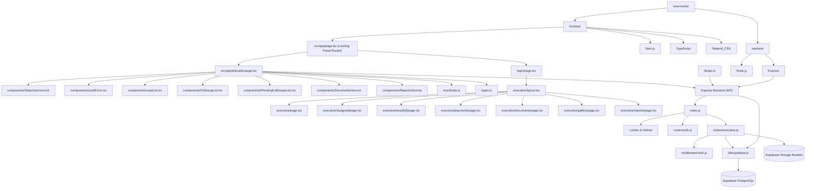

# Project Graph Report

## Overview
This repository is configured with two main independent workspaces implementing the **Shiva Gold Company Management System**:
1. `frontend/` - Next.js (App Router) project with TypeScript, Tailwind CSS v4, and dynamic transition animations.
2. `backend/` - Node.js project running an Express server with Supabase PostgreSQL connection, JWT Authentication, and RBAC middleware.

## Version Control
- A root-level `.gitignore` excludes build outputs, Node modules, and credentials environment files.
- Remote repository link: `https://github.com/softvishnuspire/sivagoldcompanytracker.git`.

## Executive & Telecaller Dashboard Architecture Graph

## Directory Structure Details

### Backend:
- `backend/index.js` - Server entry point integrating Helmet, CORS, Rate Limiters, and Router handlers. Includes database seed trigger route.
- `backend/db/supabase.js` - Exposes the Supabase client connector using local environmental keys.
- `backend/middleware/auth.js` - Implements JWT token authorization verify checks and Role-Based Access Control (RBAC).
- `backend/routes/auth.js` - Express router defining `/api/auth/login` and `/api/auth/me` profile endpoints.
- `backend/routes/executive.js` - Contains the 14 core endpoints managing case pipeline steps, uploads to Supabase buckets (configured as lowercase: `loan-documents`, `agreements`, `payment-proofs`, `gold-images`), and timeline logs.
- `backend/seed.js` - Helper script to populate default users (MD, RM, Executives, Telecaller) with bcrypt hashed passwords.
- `backend/.env` - Server environment variables file.

### Frontend:
- `frontend/src/lib/api.ts` - Centralized fetch client injecting the JWT authorization bearer token header.
- `frontend/src/app/page.tsx` - Main pre-existing login portal at root `/`, updated to use secure Express backend APIs.
- `frontend/src/app/login/page.tsx` - Client redirection route routing `/login` accesses back to root `/`.
- `frontend/src/app/md/page.tsx` - Managing Director dashboard route.
- `frontend/src/app/rm/page.tsx` - Relationship Manager dashboard route.
- `frontend/src/app/telecaller/` - Telecaller Dashboard workspace:
  - `page.tsx` - Main controller layout (handles tabs, localStorage persistence, states).
  - `types.ts` - Models for Leads, Followups, and Documents.
  - `mockData.ts` - Initial storage seeds.
  - `components/` - Subcomponents for Stats cards, CRUD Forms, searchable Lists, Call Scheduler, Pending Followups List, Documents View, and SVG Daily/Monthly Reports.
- `frontend/src/app/executive/` - Executive Dashboard workspace:
  - `layout.tsx` - Shared layout containing responsive left navigation menus and session validation controls.
  - `page.tsx` - Portal dashboard summarizing metric statistics and active operational shortcuts.
  - `assigned/page.tsx` - Assigned leads overview lists.
  - `lead/[id]/page.tsx` - Detailed lead interface containing sequential status action forms, documents catalog, bottom quick action panels, and timeline journey logs.
  - `payments/page.tsx` - Payment registry ledger lists.
  - `documents/page.tsx` - Documents preview and download listings.
  - `gallery/page.tsx` - Gold ornament gallery images grid with click-to-preview lightbox modal.
  - `reports/page.tsx` - Reports page displaying completion rates, total collection volumes, and time-frame filtering cards.
  - `visits/page.tsx` - Appointments scheduling list.
  - `in-progress/page.tsx` - Ongoing cases tracking table.
  - `completed/page.tsx` - Closed cases history list.
  - `call-logs/page.tsx` - Contact call interactions registry log.
  - `profile/page.tsx` - Personal credentials and branch access values.
- `frontend/.env.local` - Local environment variables file.

## Recent Fixes
- **LeadForm Event Refinement**: Resolved document selection closing form page by preventing form submission/page reload behavior on button actions.
- **Real File Uploads**: Replaced mock file simulation with real browser file uploading inside `LeadForm.tsx`. Connects with Supabase Storage (`loan-documents` bucket) and includes FileReader Base64 fallback (offline/local mode) to save actual customer documents into the database.
- **Client Configuration Guard**: Added validation checks in `LeadForm.tsx` to detect if the Supabase environment variables are loaded in the browser. If not loaded (e.g. dev server needs a restart), it immediately redirects to the Base64 FileReader fallback, preventing SDK relative path resolution that throws SyntaxErrors.
- **Express Payload Size & Crash Prevention**: Increased the backend Express incoming request body size limit to `200mb` (both JSON and urlencoded) in `backend/index.js` and added a global error handler middleware to prevent `413 Payload Too Large` HTML responses and server crashes when uploading and saving large Base64 document payloads.
- **Advance Status Option (Send to RM)**: Added a "Send to RM" action button in `LeadList.tsx` for leads with status `CUSTOMER_DETAILS_CREATED`. Click updates status to `SENT_TO_RM` matching the Supabase `lead_status` enum.
- **Status Enum Alignment**: Aligned all lead status strings across the entire frontend (`types.ts`, `page.tsx`, `LeadList.tsx`, `LeadForm.tsx`, `mockData.ts`, `PendingFollowupsList.tsx`, `ReportsView.tsx`) and backend (`index.js`) with the actual Supabase PostgreSQL `lead_status` enum values. All statuses now use `UPPER_SNAKE_CASE` format matching the database (e.g. `FOLLOWUP_IN_PROGRESS`, `SENT_TO_RM`, `RM_REJECTED`, `CASE_COMPLETED`, etc.).
- **Lead Source Tracking**: Added an optional "Where Did They Hear About Us?" dropdown to the Lead creation form (Step 1 - Customer Information) in `LeadForm.tsx`. Options: Website, Facebook Ads, Google Ads, Referrals, Direct Calls, Walk Ins. Wired through `page.tsx` API payloads and `backend/index.js` POST/PUT endpoints, stored in the existing `source` column on the `leads` table.
- **Executive Document Loading Robustness**: Made lead details document loading and the Documents Center robust by supporting both database `lead_documents` and aliased `documents` relation keys, and supporting both snake_case (`document_type`, `file_url`) and camelCase (`documentType`, `fileUrl`) properties, resolving the issue where documents uploaded by telecallers were not showing up in the executive view.
- **Git Merge Conflict Cleanup**: Removed a stray `<<<<<<< Updated upstream` merge conflict marker in `backend/index.js` that was causing a `SyntaxError: Unexpected token '<<'` server crash on startup.
- **Executive Upload Form Data Fix**: Fixed a critical bug in Step 8 (`AGREEMENT_PENDING`) where document copies (buyout agreements & KYC) were not appended to a `FormData` object during status change, causing them to be ignored on backend upload.
- **Gold Verification Images UI**: Added a dedicated `Gold Verification Images` photo grid display in Section 3 (`RM Remarks & Documents`) on the Lead Details page, ensuring all uploaded gold ornament images are visible directly from the case view.
- **Robust Key Parsing in Gallery & Documents**: Configured the Gallery and Documents Center components to support both snake_case (`lead_number`, `customer_name`, `image_url`, `created_at`, `payment_proof`) and camelCase (`leadNumber`, `customerName`, `imageUrl`, `createdAt`, `paymentProof`) attributes, guaranteeing uploaded assets are rendered regardless of data casing.
- **Database Document Type Enum Mapping**: Resolved database constraint insert failures (`invalid input value for enum document_type: "KYC"`) by mapping frontend document types (`KYC` and `ADDITIONAL`) to valid PostgreSQL enum values (`AADHAR`, `PAN`, `OTHER`) inside the backend creation, update, and upload routes.
- **Document Preview and Safe Download UI**: Resolved browser block issues on Base64 data URLs (e.g. `about:blank#blocked` when opening in a new tab) by building a fully integrated inline document preview lightbox modal and custom download handlers in both the Lead Details page and the Documents Center.
- **Backend Merge Conflicts & Duplicate Declarations Resolve**: Cleaned up multiple leftover git merge conflict blocks, removed duplicate module declarations (`helmet`, `rateLimit`), restored the original `DELETE /api/leads/:id` endpoint, and added the `toValidUuid()` helper function in `backend/index.js` to ensure the server starts up successfully and compiles without ReferenceErrors.
- **CORS loopback and configurable API endpoints**: Updated the backend CORS policy in `backend/index.js` to allow both `localhost` and loopback `127.0.0.1` origins, preventing `TypeError: Failed to fetch` errors in browsers that resolve localhost using IPv4 loopback. Cleaned up frontend login `frontend/src/app/page.tsx` and RM dashboard `frontend/src/app/rm/page.tsx` fetches to dynamically resolve `process.env.NEXT_PUBLIC_API_URL` instead of hardcoded `localhost:5000` URLs.
- **JWT Key Fallback Alignment**: Aligned the default fallback `JWT_SECRET` key in `backend/index.js` with the one in `backend/middleware/auth.js` (`'shivagold_super_secret_jwt_key_2026'`) and added it to the `backend/.env` file. This resolves the token validation errors on the Executive Dashboard caused by mismatching signing and verification keys when running locally.
- **Auto-Logout on Session Expired/Invalid**: Configured the frontend API request handler in `frontend/src/lib/api.ts` to automatically evict the invalid/expired session tokens from local storage and redirect the user back to the portal sign-in page if a 401 or 403 authorization error is returned by the server. This prevents users from getting locked in an infinite refresh loop on dashboard metrics error states.

