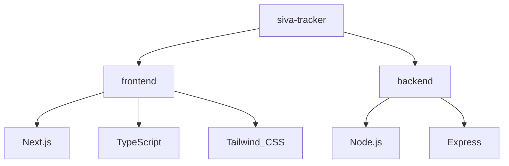

# Project Graph Report

## Overview
This repository is configured with two main independent workspaces:
1. `frontend/` - Next.js project with TypeScript, Tailwind CSS, and App Router.
2. `backend/` - Node.js project running an Express server using standard JavaScript.

## Dependency Graph

## Details
- **Frontend**: Next.js App Router (initialized using `create-next-app` under `--ts` and `--tailwind` flags).
- **Backend**: Express API server initialized at `backend/index.js` (runs on default port 5000).
