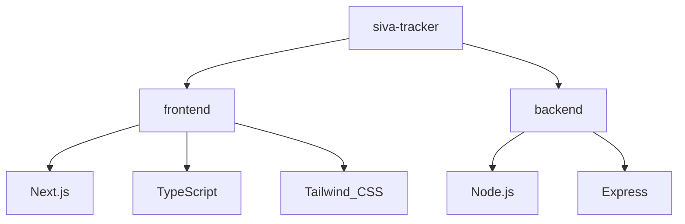

# Project Graph Report

## Overview
This repository is configured with two main independent workspaces:
1. `frontend/` - Next.js project with TypeScript, Tailwind CSS, and App Router.
2. `backend/` - Node.js project running an Express server using standard JavaScript.

## Version Control
- A root-level `.gitignore` has been added to exclude system, build, dependency, and configuration files.
- The project has been pushed to the remote repository: `https://github.com/softvishnuspire/sivagoldcompanytracker.git`.

## Dependency Graph

## Directory Structure Details
- **Frontend Paths (Role-Based Route Directories)**:
  - `src/app/md/page.tsx` - Managing Director dashboard route.
  - `src/app/rm/page.tsx` - Relationship Manager dashboard route.
  - `src/app/telecaller/page.tsx` - Telecaller dashboard route.
  - `src/app/executive/page.tsx` - Executive dashboard route.
- **Backend**: Express API server initialized at `backend/index.js` (runs on default port 5000).
