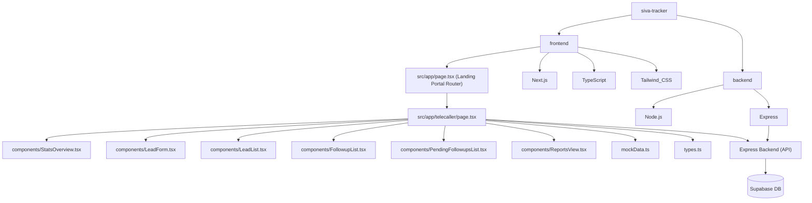

# Project Graph Report

## Overview
This repository is configured with two main independent workspaces:
1. `frontend/` - Next.js project with TypeScript, Tailwind CSS, and App Router.
2. `backend/` - Node.js project running an Express server using standard JavaScript.

## Custom Theme Palette
We have configured a brand-specific luxury color palette from Coolors:
- **Primary Background**: `#300F0F` (Deep Cherry Black)
- **Container/Card Background**: `#3D1510` (Dark Mahogany Red)
- **Borders & Hover Accent Highlights**: `#65483B` (Warm Copper Bronze)
- **Secondary Text Descriptions**: `#88868A` (Muted Slate Gray)
- **Primary Typography & Indicators**: `#D9D9DA` (Bright Silver Off-White)

Registered custom utility properties in globals.css:
- `--color-brand-mahogany`
- `--color-brand-cherry`
- `--color-brand-copper`
- `--color-brand-slate`
- `--color-brand-silver`

## Environment Configuration
We have added the environment variables file for Port and Supabase connection parameters:
- `backend/.env` — Backend node process environment variables.
- `frontend/.env.local` — Next.js client and server environment configurations.

## Version Control
- A root-level `.gitignore` has been added to exclude system, build, dependency, and configuration files.
- The project has been pushed to the remote repository: `https://github.com/softvishnuspire/sivagoldcompanytracker.git`.

## Dependency Graph

## Directory Structure Details
- **Frontend Paths (Role-Based Route Directories)**:
  - `src/app/page.tsx` - Custom brand landing portal directing to the active Telecaller dashboard.
  - `src/app/md/page.tsx` - Managing Director dashboard route.
  - `src/app/rm/page.tsx` - Relationship Manager dashboard route.
  - `src/app/telecaller/` - Telecaller Dashboard workspace:
    - `page.tsx` - Main controller layout (handles tabs, localStorage persistence, states).
    - `types.ts` - Models for Leads, Followups, and Documents.
    - `mockData.ts` - Initial storage seeds.
    - `components/` - Subcomponents for Stats cards, CRUD Forms, searchable Lists, Call Scheduler, Pending Followups List, and SVG Daily/Monthly Reports.
  - `src/app/executive/page.tsx` - Executive dashboard route.
  - `.env.local` - Local environment variables file.
- **Backend**: Express API server initialized at `backend/index.js` (runs on default port 5000). Exposes endpoints for Lead CRUD, Status updates, and Follow-ups, communicating directly with Supabase.
  - `.env` - Server environment variables file.

